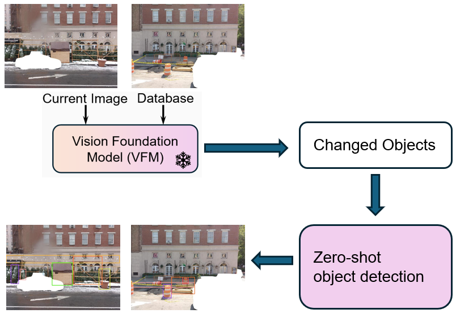

# Annotation

## Visual Foundation Model
Install modules imported in gpt.py.

Run gpt.py to get test.txt with the description of objects appearing in only db_1.jpg or q_1.jpg.

Modify the variable image_pairs to store more paths of image pairs as tuples.

## Zero-shot object detection
Install Grounded-SAM following the README.md in Grounded-SAM-2 folder.

Modify the source_txt_file on line 34 of grounded_sam2_hf_model_demo.py for the path of the txt file generated by gpt.py.

Modify the path on line 64 of grounded_sam2_hf_model_demo.py for the paths of image pairs.

Run grounded_sam2_hf_model_demo.py to get the segmented mask as the annotation.